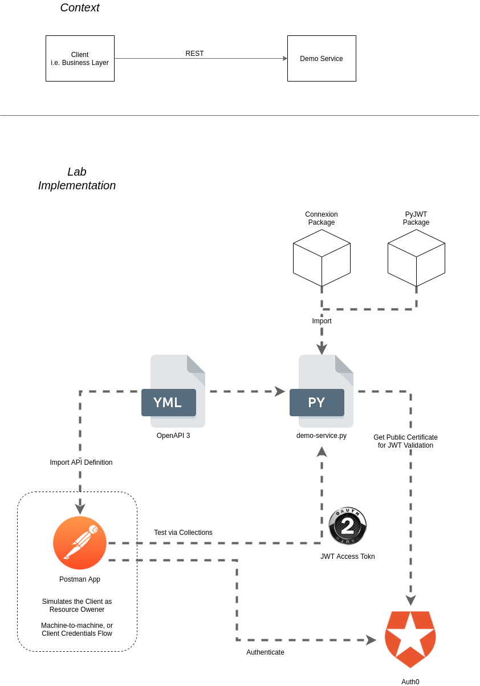

- [Postman Learnings via Demo App](#postman-learnings-via-demo-app)
- [Requirements and Assumptions](#requirements-and-assumptions)
- [Additional Resources](#additional-resources)
- [Getting started](#getting-started)

# Postman Learnings via Demo App

A demonstration of how several technologies can work together. The main aim was to learn Postman, and specifically scripting in Postman.

This repo contains all the scripts and config files to demonstrate some of the basic Postman scripting functionality through an actual running service with Authentication and Authorization.

The lab design can be seen in the following diagram:

# Requirements and Assumptions

The demo was developed on a Linux system, but should work on most modern operating systems. Some additional steps or tweaks to steps may be required for some environments. 

Basic Requirements:

* Operating system that supports Python 3 and Postman
* Python 3
* Postman

From an experience perspective, the following basic knowledge and experience should be sufficient to follow the examples:

* Basic understanding of what [JSON](https://en.wikipedia.org/wiki/JSON) is
* Basic understanding of what [REST](https://en.wikipedia.org/wiki/Representational_state_transfer) is
* Familiarity with Python and [`pip`](https://realpython.com/what-is-pip/)
* Comfortable on the command line
* General understanding of [OAUTH2](https://oauth.net/2/) and [what it is](https://developer.okta.com/blog/2017/06/21/what-the-heck-is-oauth)
* Some experience in [making REST calls with curl](https://www.codepedia.org/ama/how-to-test-a-rest-api-from-command-line-with-curl/) will also go a long 

# Additional Resources

* Auth0 References:
  * [Which OAuth 2.0 Flow Should I Use?](https://auth0.com/docs/authorization/which-oauth-2-0-flow-should-i-use)
  * [Call Your API Using the Client Credentials Flow](https://auth0.com/docs/flows/call-your-api-using-the-client-credentials-flow)
* RFC's:
  * [RFC 6749 - The OAuth 2.0 Authorization Framework](https://tools.ietf.org/html/rfc6749)
* OpenAPI 3:
  * [What is OpenAPI 3?](https://swagger.io/docs/specification/about/)
  * [OpenAPI 3 Specification](https://github.com/OAI/OpenAPI-Specification/blob/master/versions/3.0.2.md)
  * [More examples and explanations of concepts](https://swagger.io/docs/specification/basic-structure/)
* Python 3 Packages:
  * [Connexion Documentation](https://connexion.readthedocs.io/en/latest/)
  * [PyJWT Documentation](https://pyjwt.readthedocs.io/en/latest/index.html)

# Getting started

Please use the [Wiki for detailed instructions](https://github.com/nicc777/learning-postman/wiki/1_Getting_Started).